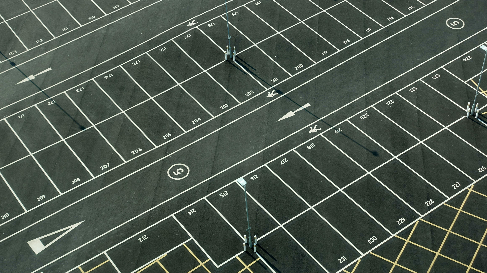
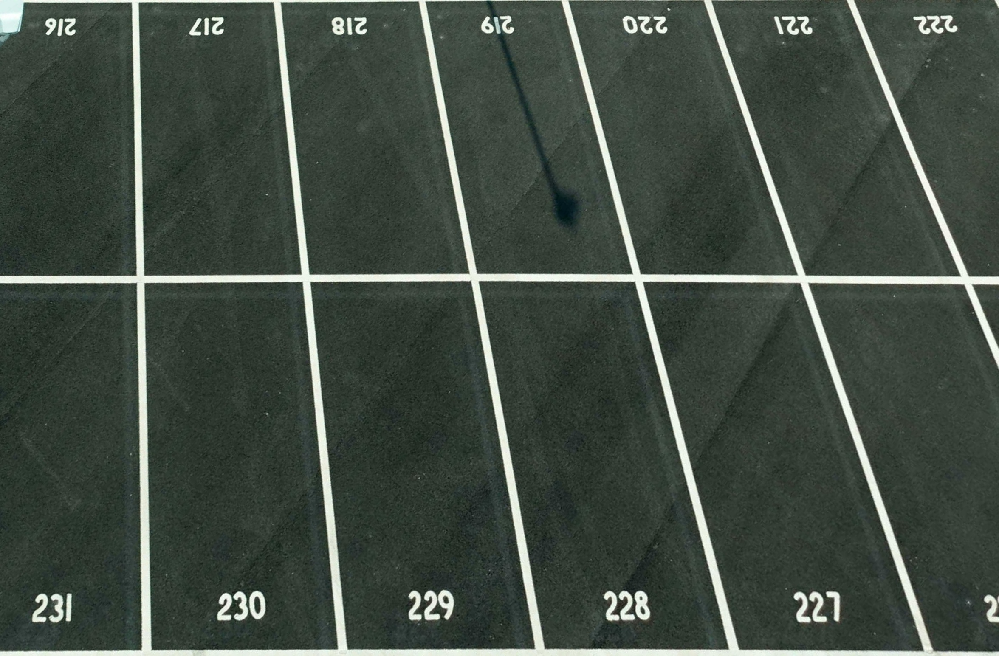
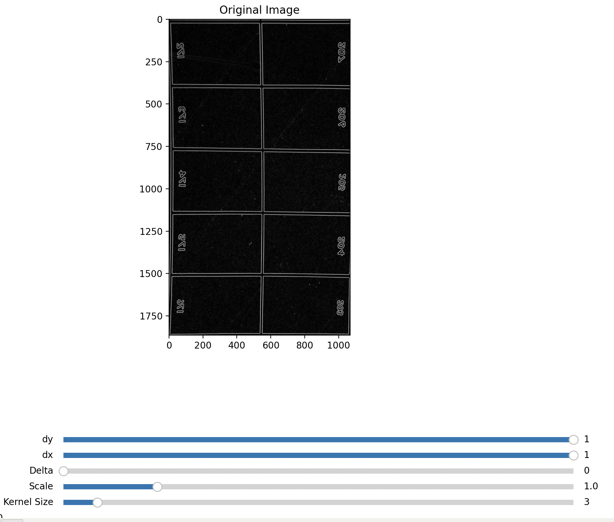
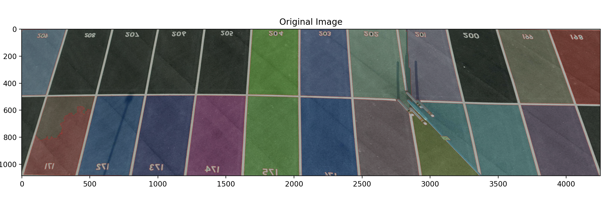
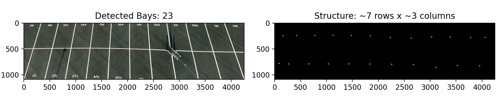
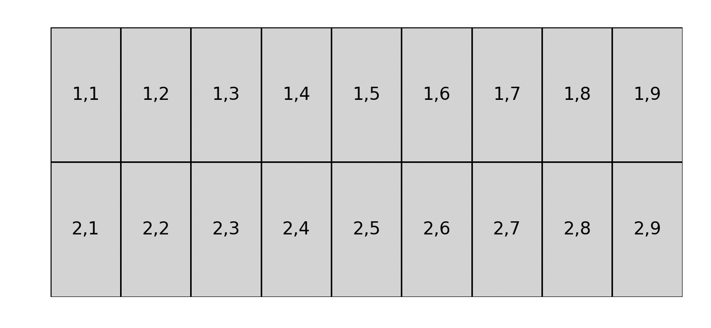
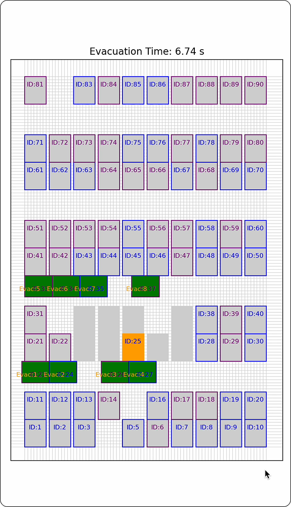

# Fleet Depot Risk Assessment 
**Team**
*Sonny (Ziyang) Kong* 
*Yi Haung*

## Context
Electric vehicles are essential to sustainable energy transition, but they pose unique challenges compared to traditional cars. Because EV fires are:
- Fast, they are explosive and can proopogate to nearaby vehicles within just 2 minutes, 
- They are also very stubborn, meaning they generate extremely high temp and are difficult to put out with a high risk of reignition. 

Hence, whenever it happens in a densely populated carpark, it would’ve caused a catastrophe of several cars on fire before the firefighters arrive.

## Project Scope
The project aim to support the auto-evacuation of autonomoous vehicles at fleet depots by producing a digital twin of the depot. 

For simplicity, it aims to produce a digital twin of a car park from camera footage, assisting the downstream task escape route algorithm design. 

Most of the current repos that monitors the car park . For example:
[bron322/CarParkSpaceDetection](https://github.com/bron322/CarParkSpaceDetection)

[Harshilmalhotra/ParkSpot-Monitoring-System](https://github.com/Harshilmalhotra/ParkSpot-Monitoring-System)

There are some other techniques, include deep learning, with [GNN](https://arxiv.org/pdf/2104.02576) or [YOLO](https://github.com/Arpitpatel1706/car-parking-slot-occupancy-detection-using-YOLOv8---openCV) to classify images. However, all these models require the image/video to be strictly from a top-down view. They also don't provide detailed detail, such as distance between different points on the monitoring footage, to supplement planning of evacuation 

This project will aim to create a pipeline that performs the geometric transformation first, then suppliment relevant distance data through segmentation of the image into cellular form to feed into the downstream planning algorithm I previously built due IDE group project. 

# Tasks (Goals)
The specific steps include:
1. Homography transoformation, specifically perspective correction. [Example](https://learnopencv.com/homography-examples-using-opencv-python-c/)
2. Using OpenCV Sobel operator to denoise
3. Create a digital twin of the car park
4. Count the amount of cars within the car park

# Requirements

The project requires the following Python packages. You can install them using the provided requirements.txt file:

```numpy>=1.19.2
opencv-python>=4.5.1.48
matplotlib>=3.3.2
```
To install the required packages, run the following command in your project directory:

```pip install -r requirements.txt```


# Instructions for Use


For tasks 1-3, please access and run the 0_full_pipline.py file. 
1. Once ran, please select 4 corner points from the image that you would like to shift your persepctive onto
2. Once 4 points are selected, please press any key OTHER THAN "0" to run the transform. You will see the transformed image and the parking bays identified
3. Press "0" to close all windows
4. You will now see the digital twin of the car park

For task 4, please access the xm.m file and follow the instruction there. 


# Work Log

This is the original image.


This is the warped image after mannually selecting 4 points to transform perspective.



Sobel achieves the cleannest picture during preprosessing.


Watershed with kenel 3 already achieves good results. Need to increase the kernel size 


Kernel 4 achieved perfect results. Here, calculating the Y axis results, we can quickly group the center of each bay into a matrix that reflects the number of rows and columns.

Currently using an average of height to count the number of parking bays within a row. If the next point’s y‐coordinate is within avg_height/2 of the first point in the current row, we put it in the same row; otherwise, we start a new row.


```
centers_sorted_y = sorted(centers, key=lambda c: c[1])  # sort by y-coordinate
y_coords = [c[1] for c in centers_sorted_y]
y_diffs = [y_coords[i+1] - y_coords[i] for i in range(len(y_coords)-1)]
avg_height = np.mean(y_diffs) if y_diffs else 0

row_clusters = []
current_row = [centers_sorted_y[0]]

for i in range(1, len(centers_sorted_y)):
    # Check if this point's y is close to the first point of the current row
    if abs(centers_sorted_y[i][1] - current_row[0][1]) <= avg_height / 2:
        current_row.append(centers_sorted_y[i])
    else:
        row_clusters.append(current_row)
        current_row = [centers_sorted_y[i]]

if current_row:
    row_clusters.append(current_row)
```
But the centers of the watershed image is extremly uneven. Let's try using a percentage threshold instead, something like 30-60% of the entire image height will still allow the point to be counted in the same row.

Now it's time to replicate this using some mannually measured data in the real enviroment. Let's say the parking bays 2.6 meters in width and 5.0 meters in length. 




Voila, here's replicated car park. Next step is to overlay this onto a cellular grid. 

Below is an example of what the planning algorithem look like. The goal is to be able to project the parking lots onto a cellular grid. 



# Strength and Limitations
- Task 1-3 aims to produce a rapid digital tiwn of the car park. 
    - Pros: It is fast and reliable for car parks that are relatively even.
    - Cons: Task 1 still require human intervention. However this can be quick data labeling tools to develop a dataset with input(car park image) and output (4 corners points) to build a ML model that automatically segements and provide points for persepective transformation. 
- Task 4 aims to count the number of cars within a car park
    - Pros: It can process videos
    - Cons: It can include errors that count other objects as cars. Further training on the model can help reduce error rate.


# Disclaimer
The use of generative AI has been used within this project for the purpose of code debugging and readability improvement of the report. 